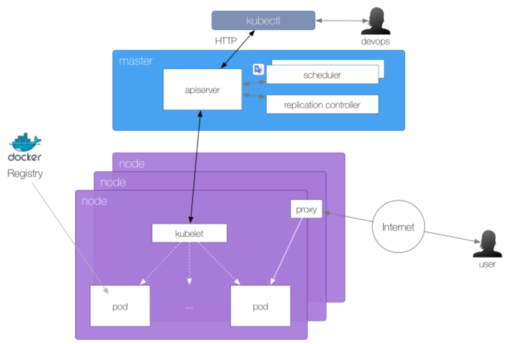

# OpenSSL

OpenSSL 是一个开源的软件库，里面包含了SSL协议库、应用程序以及密码算法库。通过这个工具我们可以实现自签名证书，也可以更好的了解证书生成的过程。

# OpenSSL 使用

## 安装环境

Linux 系统一般自带 OpenSSL 工具：

```shell
[root@instance-fk6xgagd ~]# openssl version
OpenSSL 1.0.2k-fips  26 Jan 2017

```

Window 环境到官网下载 exe 应用工具，并将 exe 应用配置到系统环境变量 Path 路径中即可。

## 命令

OpenSSL 的命令可以分为以下3类

1. **Standard commands** ：一些标准的工具集合（ca证书工具等）；
2. **Message Digest commands**： 摘要生成的命令工具（哈希算法等）；
3. **Cipher commands** ：加密工具（对称非对称算法等）。

```shell
[root@instance-fk6xgagd ~]# openssl help
openssl:Error: 'help' is an invalid command.

Standard commands
asn1parse         ca                ciphers           cms               
crl               crl2pkcs7         dgst              dh                
dhparam           dsa               dsaparam          ec                
ecparam           enc               engine            errstr            
gendh             gendsa            genpkey           genrsa            
nseq              ocsp              passwd            pkcs12            
pkcs7             pkcs8             pkey              pkeyparam         
pkeyutl           prime             rand              req               
rsa               rsautl            s_client          s_server          
s_time            sess_id           smime             speed             
spkac             ts                verify            version           
x509              

Message Digest commands (see the `dgst' command for more details)
md2               md4               md5               rmd160            
sha               sha1              

Cipher commands (see the `enc' command for more details)
aes-128-cbc       aes-128-ecb       aes-192-cbc       aes-192-ecb       
aes-256-cbc       aes-256-ecb       base64            bf                
bf-cbc            bf-cfb            bf-ecb            bf-ofb            
camellia-128-cbc  camellia-128-ecb  camellia-192-cbc  camellia-192-ecb  
camellia-256-cbc  camellia-256-ecb  cast              cast-cbc          
cast5-cbc         cast5-cfb         cast5-ecb         cast5-ofb         
des               des-cbc           des-cfb           des-ecb           
des-ede           des-ede-cbc       des-ede-cfb       des-ede-ofb       
des-ede3          des-ede3-cbc      des-ede3-cfb      des-ede3-ofb      
des-ofb           des3              desx              idea              
idea-cbc          idea-cfb          idea-ecb          idea-ofb          
rc2               rc2-40-cbc        rc2-64-cbc        rc2-cbc           
rc2-cfb           rc2-ecb           rc2-ofb           rc4               
rc4-40            rc5               rc5-cbc           rc5-cfb           
rc5-ecb           rc5-ofb           seed              seed-cbc          
seed-cfb          seed-ecb          seed-ofb          zlib
```

# TLS服务认证案例

Kubernets 是一个开源的容器编排工具，它内部包含了多个职能组件。Kubernetes 提供了基于 CA 签名的双向认证和基于 HTTP BASE 或 TOKEN 的认证方式，其中 CA 是安全性最高的一种。（不了解 Kubernetes 的把他想成一个多组件服务的系统即可）



Kubernetes 有上图那么多组件，具体每个组件的用途我们这里不用去了解，其中 **ApiServer** 是一个核心服务。

## **图中服务需要的证书：**

1. Kube-APIserver对外提供服务，要有一套 kube-apiserver server 证书；
2. kube-scheduler、kube-controller-manager、kube-proxy、kubelet；和其他可能用到的组件，需要访问 kube-APIserver，要有一套 kube-APIserver client 证书；
3. kube-controller-manager 要生成服务的 service account，要有一对用来签署 service account 的证书(CA证书)；
4. kubelet 对外提供服务，要有一套 kubelet server 证书；
5. kube-APIserver 需要访问 kubelet，要有一套 kubelet client 证书；

## 基于CA 的双向数字证书认证

各个服务都需要双向认证，所以每个服务都需要有自己的证书，证书是需要向 CA 申请的，所以我们要先制作 CA 根证书。

### CA 证书的生成

先生成根证书，这个根证书后续将用于为每个组件生成属于他们的证书。

1. 先生成 CA 私钥，长度为 2048。

   ```shell
   # openssl genrsa -out ca.key 2048
   ```

2. 用私钥直接生成 CA 的根证书，证书的版本是 x509，过期时间 5000 天，使用者信息用的是主机名 `/CN=k8s-master`

```shell
openssl req -x509 -new -nodes -key ca.key -sub "/CN=k8s-master" -days 5000 -out ca.crt
```

### ApiServer 证书生成

1. 生成长度为 2048 的私钥

```shell
openssl genrsa -out server.key 2048
```

2. 通过配置文件创建 csr（证书请求文件）

```shell
openssl req -new -key server.key -sub "/CN=k8s-master" -config master_ssl.cnf -out server.csr
```

其中 master_ssl.cnf 文件主要包含了请求主体的一些基础信息，这边主要是服务器所在节点的主机名，IP 地址。这些信息后面也会生成到证书里面，像 IP 地址后续也可以作为校验使用。

3. 通过 csr 文件生成最终的 crt 证书：

```shell
openssl x509 -req -in server.csr -CA ca.crt -CAkey ca.key -CAcreateserial -days 5000 -extensions v3_req -extfile master_ssl.cnf -out server.crt
```

生成证书的时候都需要借助 CA ，CA用自己的私钥签名生成证书，把公钥开放出去，供验证者使用。

到此，我们已经总的已经生成了 5 个文件，回顾下它们的作用：

- ca.key：为了生成 CA 根证书；
- ca.crt：根证书，为了给后续的其它组件服务颁发证书用的；
- server.key：为了生成 apiServer 证书；
- server.csr：为了生成证书请求文件（这边没有直接通过私钥生成证书，而是多了一个 CSR 的环节）；
- server.crt：最终 apiServer 的证书。

ApiServer 启动的时候有下面 3 个核心参数：

1. 提供 TLS 安全服务所需的证书（让别人验证自己的）；
   **tls-cert-file** ：apiServer 自己的证书文件；
   **tls-private-key-file** ：apiServer 的私钥；
2. apiServer 提供给很多客户端用，每个客户端都需要自己的证书，这边指定了根证书，客户端必须是从该证书申请的才认可；
   **client-ca-file string** ：CA 根证书。

#### 某个访问 apiServer 客户端证书的生成

```shell
openssl genrsa -out cs_client.key 2048
openssl req -new -key cs_client.key -sub "/CN=k8s-master" -out cs_client.csr
openssl x509 -req -in cs_client.csr -CA ca.crt -CAkey ca.key -CAcreateserial -days 5000 -extensions v3_req -extfile master_ssl.cnf -out cs_client.crt
```

依然是生成自己的私钥，证书请求CSR文件，后面生成最终的证书需要借助上面的 CA 私钥 和 CA 根证书。

这边一个组件的双向证书都生成了，其它组件就不一一举例。

# 小结

TLS 的整个认证还是比较复杂的，OpenSSL 帮我们封装了很多内置算法，即便这样这个过程下来流程还是比较多，需要我们抽丝剥茧慢慢了解。

 