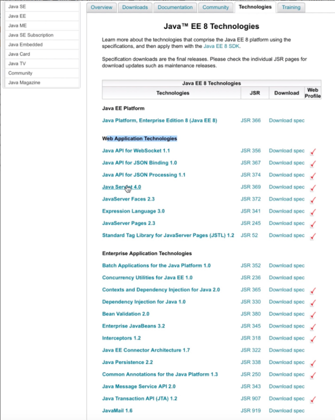
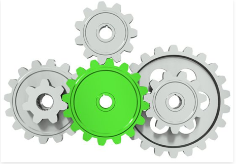
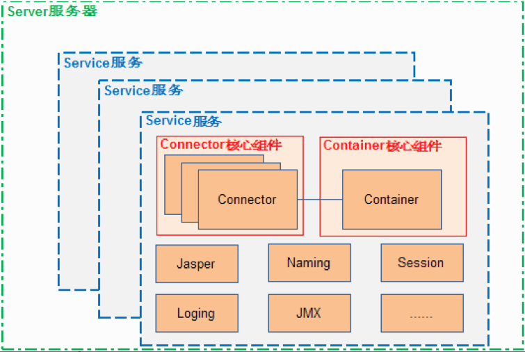
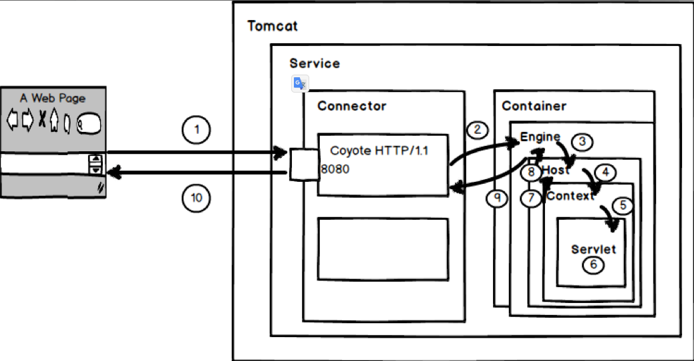
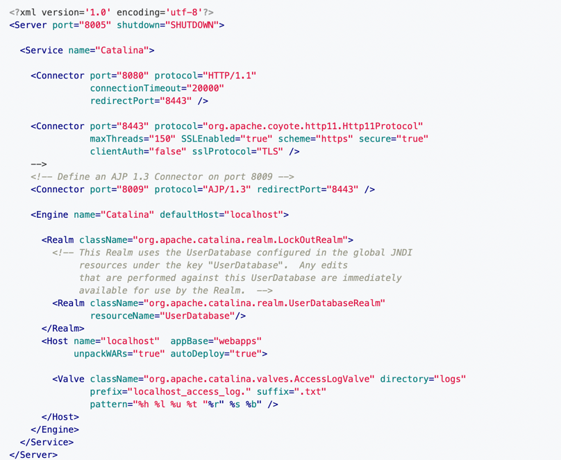

# APACHE TOMCAT

Tomcat 是一个开源免费的 Web 服务器，它跟 Httpd 一样有处理静态 Html 的能力，除此之外它还是 Servlet 和 Jsp 的容器，通俗地说可以搭载 Java 的 Web 应用。

## Web 容器和 J2ee 容器的区别

### Web 容器

- 静态的 Html
- 动态的 Jsp 或者 Php 等

### J2ee 容器

- 符合 J2ee 规范的容器

Tomcat 是一个 Web 容器，同时也是实现了**部分 J2ee 规范**的服务器

##  J2ee 规范

在我们软件开发的早期，每个公司都是独立的开发自己的软件系统，但是各个系统是有相同的功能的，比如大部分的软件都是要存储数据，后来有了各种数据库，J2ee 给这种数据库连接制定了 Jdbc 规范，Mysql 和 Oracle 这种数据库提供商都是遵从这个规范来实现的，如果我们的代码也是遵从这个标准，那我们的系统假如要从Mysql 换到 Oracle 也是很方便的，不用大量重构代码。除此之外还有大量公用的功能，比如发送邮件等，于是有了建立在 Java 平台的企业级应用解决方案的规范。下面是 Java 官网展示的 J2ee 协议。



Tomcat 版本介绍图：


从 Tomcat 版本的介绍图，我们可以了解到，Tomcat 主要实现了如下 J2ee 规范：

- Servlet
- Jsp
- El
- Websocket
- Jaspic

而且这其中的一些在有些低版本也是没有的，像常见的 Websocket 协议，需要 Tomcat7.x 以上的版本才有，如果你需要用到此功能，就要选择好对的版本。

## Java 代码如何与 Tomcat 合作？



Tomcat 也可称作 Servlet 容器，Servlet 是它与 Java 应用的桥梁，Tomcat 重点解决了 Http 的请求连接，使得 Java 应用可以更专注处理业务逻辑。

Servlet 是一套规范，所以它主要的工作就是定义一些接口，每一个接口解决不同的逻辑功能。请求到达 Tomcat，Tomcat 的 Servlet 齿轮转动（调用）起来，触发了 Servlet 的应用代码。

# Servlet

下面是 Java 的 Servlet 定义的接口，所有的 Servlet 程序都需要继承这个接口。

```java
public interface Servlet {
    void init(ServletConfig var1) throws ServletException;

    ServletConfig getServletConfig();

    void service(ServletRequest var1, ServletResponse var2) throws ServletException, IOException;

    String getServletInfo();

    void destroy();
}
```

1. 在 Tomcat 启动的时候，Tomcat 也有自己的 init 初始化方法，这个方法层层调用，最终也会触发 Servlet 程序的 init 方法，也就达到了启动 Tomcat 应用的时候也启动了我们的 Servlet 程序。
2. 请求到达 Tomcat 的时候会根据路径选择，最终触发某个 Servlet 的 `service`方法。

# Tomcat 架构介绍

## 代码结构



Tomcat 也是用 Java 编写的一个应用，正常开发一个软件的时候都会根据功能职责对代码进行划分。

- **Server**：tomcat的一个实例；
- **Service**： connector和container的逻辑分组；
- **Connector**：负责接收请求；
- **Container**：负责处理请求。

##  请求流程



1. 浏览器发起请求；
2. Tomcat 响应请求，然后封装成统一的对象交给 Engine 处理。图片显示的是 Http 协议的处理，但是 Tomcat 的设计并不只是为了 Http 这个协议，还可以有其它的如 Ajp 协议。从 Engine 的角度它对这些处理是透明的（可以不关心的）；
3. Engine 将请求分配给一台Host机器去处理；
4. 一台机器上面可能同时部署了多个 Java Web 应用，这时候通过 Context 这个上下文可以定位到具体的哪个 Web 应用；
5. 交给应用中具体的某个 Servlet 处理；
6. 原路一个个返回，将处理的响应结果传输给浏览器。

## 配置



# 小结

Tomcat 没有 Httpd 和 Nginx 那样强大的重定向机制，但是它主要是在 Java 的 Web 领域的，所以跟他们之间没什么竞争关系可言。在 Java 方面，Tomcat 也只是实现了部分 J2ee 规范的服务器，市场上面不乏完整 J2ee 规范的服务器（JBoss、WebSphere 等），Tomcat 能够流行主要是因为它是开源免费的且各方面也表现不错，其它类型的服务器大多要收费。而且 Tomcat 从各个版本可以看出它正在不断地实现更多 J2ee 规范的过程中。