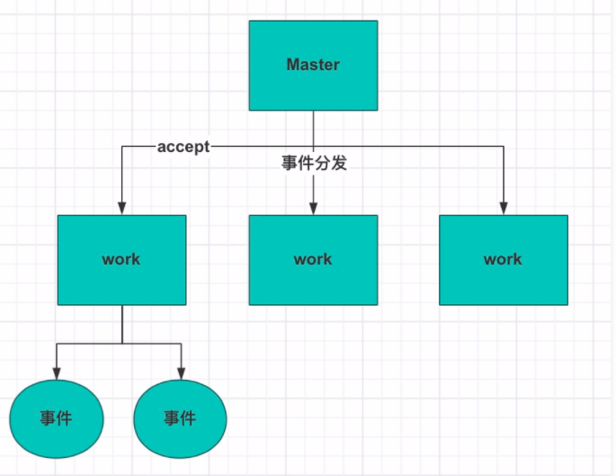
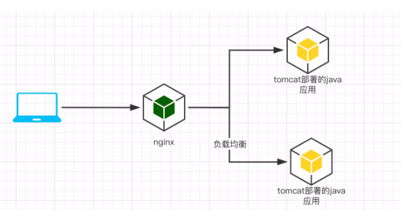

# Web 服务器：NGINX

前面讲过的 Httpd 和 Tomcat 以及这个小节所讲的 Nginx 都是 Web 服务器，他们三者发展到今天并没有很明显地成为某个产品一枝独秀的强垄断局面，因为他们有各自的特点和适用的场合，在某些场合他们甚至可以共用达到互补的功能。

# Nginx 简介

Nginx 是由俄罗斯工程师伊戈尔·赛索耶夫开发的，同样是开源免费的。虽然它和 Httpd 与 Tomcat 都称为 Web 服务器，但是它的功能强大得简直不像是个 Web 服务器，比如它的反向代理和负载均衡，几乎成了现在 Web 应用的必备基础设施。与此同时它的高并发处理能力也是很强大的，是 Httpd 强有力的竞争者。至于实现 Servlet 规范的 Tomcat 倒是替代不了，因为 Nginx 不支持。

## **三种服务器各自适用场景**：

- **Nginx**：适合静态内容服务和反向代理服务器；它的特点是并发能力强，但是不适合 CPU 密集的请求，因为并发场景的 CPU 上下文的切换花销挺高的。所以很适合当网关做代理来分发请求的场景。
- **Httpd**：适合Rewrite 场景比较多，对 CPU 资源有一定要求的场景；并发能力相对弱些，可以借助 Nginx 的分发做负载均衡，水平扩展 Httpd 的服务能力。
- **Tomcat**：Java 应用容器，同样可以借助 Nginx 实现水平服务的扩展；

## 选择 Nginx 的理由：

- 轻量且并发能力强；
- 反向代理服务器的大规模可扩展事件驱动架构；
- 多重身份：Web 服务器，可代理七层协议的负载均衡服务器，可作为邮件代理服务器。

# Nginx 支持高并发的原理

前面我们也说了，Nginx 的并发能力非常好，那么它能支持这么大的并发量与其他的 Web 服务器差别在哪里呢？

一般的 Web 服务器在解决并发问题时，通常采用多线程或者多进程来处理请求。这种处理机制在访问量小的时候处理能力确实不错，但是当并发量大了线程或者进程频繁地切换对资源是一种非常大的损耗。

但是 Nginx 却是单线程的，它采用 **事件驱动 + IO 多路复用的处理模型**。

- 单线程可以解决线程切换的损耗和多线程的资源竞争问题；
- **事件驱动：** Nginx 在启动后，master 进程 fork() 多个相互独立的 worker 进程，请求的事件由 work 进程去处理；
- **IO 多路复用：** 一个请求的处理过程并不是独占一个 work 进程，当请求有阻塞等待的时候，work 进程会空出来去处理其它的请求。



# 反向代理

代理一词在我们生活中很常见，有反向代理肯定也有正向代理。他们之间的主要区别是，正向代理客户端明确地知道自己最终访问的是谁，反向代理客户端就只了解到代理服务，不清楚具体谁在提供服务。以下列举 2 个例子说明：

- **反向代理**：你去商店买东西，东西是商家到厂里进货过来的，你不需要知道具体的厂家，只要关心你所需要的商品；**Nginx** 就是一个典型的反向代理服务器，所有人都只知道 `Nginx` 的服务地址，`Nginx` 再负载到后端去请求别到服务。
- **正向代理**：你在网上点了外卖，你清楚地知道是哪个商家提供的食品，但是这个外卖并不是你直接去拿的，是经由外卖小哥帮你送来的，这个过程中你和食品店的老板都知道双方的存在，那么外卖小哥就是你的一个正向代理而已。

##  反向代理的好处

- 可以隐藏后端的具体服务，提高了系统的安全级别；
- 可以实现服务的负载均衡，请求经代理转发到不同的服务提供者，可以无限扩容后端服务，提高并发处理能力；
- 结合监控服务，可以智能地移除故障机器上面的服务，提高可靠性。



# Nginx 配置

反向代理你可以简单的理解为转发，转发重要的一点是要配置转发规则。Nginx 配置的默认位置是在 `/conf/nginx.conf`，配置中关于 Http 的主要配置如下：

```json
 http {                      
    ....
 
    server {
       listen 80;#监听端口
       server_name localhost;#域名
        
        # 禁止访问隐藏文件
       # Deny all attempts to access hidden files such as .htaccess, .htpasswd, .DS_Store (Mac).
       location ~ /\. {
                deny all;
                access_log off;
                log_not_found off;
       }
    
       # 默认请求
       location / {
                # 首先尝试将请求作为文件提供，然后作为目录，然后回退到显示 404。
                # try_files 指令将会按照给定它的参数列出顺序进行尝试，第一个被匹配的将会被使用。
                # try_files $uri $uri/ =404;
      
                try_files $uri $uri/ /index.php?path_info=$uri&$args =404;
                access_log off;
                expires max;
       }    
 
	  # 所有动态请求都转发给tomcat处理  
        location ~ .(jsp|do)$ {  
            proxy_pass  http://test;  
        } 
        
	    upstream test {                    # 负载均衡配置
	        server localhost:8080;  
	        server localhost:8081;  
    }
}


```

- Http：某台虚拟服务器；
- Server : 定义了服务器监听哪个端口，哪个域名（可以有多个域名解析到同一台服务器上面）；
- Location ：根据请求路径，做不同的响应和转发；
- Upstream ： 里面可以配置多个监听的服务地址，请求过来可以依次亦或根据配置的权重进行轮询，从而达到负载均衡的效果；

Nginx 修改完配置可以不用重启，运行下面命令重新加载下配置。

```shell
nginx -s reload
```

# 小结

Nginx 总体使用起来比较简单，它的并发模型有别于一般的 Web 服务端，是用单线程的事件驱动 + IO 复用模型，这种模型适合处理 IO 密集型不适合 CPU 密集型的场景，Httpd 正好相反。所以 Nginx 特别适合充当一个请求转发的代理角色。Nginx 的 Work 数量和每个 Work 能同时处理的请求数量都是可以在配置调整的，这个可以根据具体的服务器性能做相应的优化调整。Work 的数量一般是对应服务器的 CPU 核数。