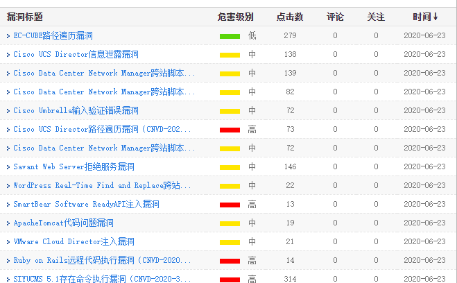

# WEB 应用威胁有哪些？

在之前的小节中，我们谈到网络的整个链路很长，每一个环节都有可能存在危险。这种威胁可能是物理硬件，操作系统，操作系统上面的软件漏洞，协议漏洞，甚至是人的某些行为导致，场景非常多而本节主要聚焦 Web 层面的安全问题。

# Web 安全简介

Web 安全是个大课题，面对层出不求的黑客漏洞，个人能力很有限制，所以这边介绍一个平台 [国家信息安全漏洞共享平台](https://www.cnvd.org.cn/flaw/typelist?typeId=29)，可以到上面注册个账号，并订阅漏洞信息报送。

针对各类漏洞笔者归类了 3 个方面：

1. 注入与欺骗；
2. 编程代码逻辑缺陷；
3. 服务器问题；

##  注入与欺骗

注入一般是将恶意代码以参数的形式传入系统，并诱使系统或者用户手动触发代码事件。欺骗通常是伪造某个客户端身份去访问服务器。

### 会话模拟

#### 会话标识

因为 Http 是无状态协议，服务端为了区别不同请求分别来自哪个用户，一般借助的是 Session 和 Cookies。Session 的数据存储在服务端，而 Cookies 存储在客户端。

因为 Http 是无状态协议，服务端为了区别不同请求分别来自哪个用户，一般借助的是 Session 和 Cookies。Session 的数据存储在服务端，而 Cookies 存储在客户端。
Cookies 以键值对的方式存储在浏览器中，设置 Cookies 的时候如果指定了过期时间，对应的值就会写到本地磁盘中，时间到了自动剔除。如果没有设置过期时间，它的生命周期就是浏览器关闭了就消失了。
Session 虽然存储在服务端，但是它的 SessionId 也存了一份在客户端的 Cookies 中的，并且它的生命周期随着浏览器的关闭而消失。Http 有个机制：**请求的时候会把浏览器中当前域名对应作用域下的所有 Cookies 都发送到出去**，所以同一个作用域下的 Cookies 对象不要太多，会影响每次请求的带宽。服务端就能从请求中拿到 SessionId ，从而查出具体的 Session 对象。

#### 模拟会话

在了解了会话标识的过程后，我们发现只要拿到了用户的 SessionId 就能很容易的假冒用户的身份去与服务端交互。

##### 场景

**场景1**：

开发中我们会用 Http 请求工具，如 PostMan 去调用我的接口，验证接口的出入参。如果系统需要登录才能访问，我们比较简便的做法是用浏览器先登录，然后将浏览器的 SessionId 设置到 PostMan 中，此时接口就能访问了。

**场景2**：

浏览器的 SessionId 自己能容易获得，但是别人要拿到还是相对困难的，于是有一种名为 **CSRF** 跨站点请求伪造(Cross—Site Request Forgery) 的攻击出现。用户登录 A 网站，然后又打开了另一个标签页访问 B 网站，如果此时 B 中隐藏了 A 网站某个请求的链接，到用户点击了，就会以当前用户的身份去触发对应的事件。

### 跨站脚本攻击（XSS）

XSS 跨站脚本攻击（Cross-site scripting）使用到的技术主要为 HTML 和 Javascript 脚本。
攻击者将对客户端有危害的代码放到服务器上作为一个网页内容，用户不经意打开此网页时，这些恶意代码会注入到用户的浏览器中并执行，从而使用户受到攻击。一般而言，利用跨站脚本攻击，攻击者可窃取会话 Cookie，从而获得用户的隐私信息，甚至包括密码等敏感信息。

### SQL 注入

Web程序代码中对于用户提交的参数未做过滤就直接放到SQL语句中执行，导致参数中的特殊字符打破了SQL语句原有逻辑，黑客可以利用该漏洞执行任意SQL语句。

**场景**

###  域名劫持

我们通过域名访问某个网站的时候，需要 DNS 域名解析系统帮忙解析出对应服务器的 IP 地址。如果域名服务器收到攻击，那黑客就可以将我们的域名任意解析到另一个服务器过去了。当然也可能是直接通过病毒软件修改我们本地的 hosts 文件。

## 编程代码逻辑缺陷

### 敏感数据依赖前端参数

系统中的重要参数需要后台重新计算，如商品购买的价格，限时购买中的时间等，对客户端的输入保持警惕。

### 接口限制问题

**场景1：** 登录的接口失败没有次数限制，会被暴力破解。
**场景2：** 短信发送的接口没有次数限制，容易被滥用，造成损失，甚至被非法分子用来做短信轰炸。

### 第三方依赖包的漏洞问题

我们代码工程里面会引入很多第三方依赖包，整个系统的安全性就像漏斗效应，一旦某个依赖包被发现漏洞，我们的整个系统也等于存在威胁边缘。
例如下面常见的一些依赖包:

1. struct
2. fastjson
3. httpclient
4. apache commons
5. spring
6. 。。。。

### 权限控制问题

**场景1：** 权限只在前端设置，接口没有做校验，了解 HTML 的人很容易可以将某些隐藏的按钮显示出来，从而触发对应的功能。

## 服务器问题

### 服务器信息泄露

- SSH 密码泄露
- WEB 控制端密码泄露（阿里，腾讯，百度等控制台，宝塔控制台等）
- IP 地址 ，操作系统信息

### 软件漏洞

系统上面安装的软件存在漏洞，被探测工具扫描到，就可能利用你这个漏洞入侵你的操作系统。

### DDOS攻击

DDOS（Distributed Denial of Service）也是一种经典的攻击模式，它不是利用服务器存在什么漏洞，而是直接粗狂的用大流量来访问你的网站，使你的网站承受不了这么多流量而崩溃。这种模式有时候还挺难处理的，因为流量的来源可能是一种变化的，都没有固定 IP 防不胜防。而这些攻击你的电脑可能是来自各地的私人电脑，只是被黑客利用了的傀儡机。

# 小结

网络威胁与网络安全是一个不断演化的过程，通过学习上面的一些经典场景，可以了解到威胁的主要入侵方式。虽然很多久的漏洞都被浏览器、协议、软件框架优化了，但是新变种的入侵方式往往也是旧模式上面的创新，毕竟理论基础是逃不开的。

