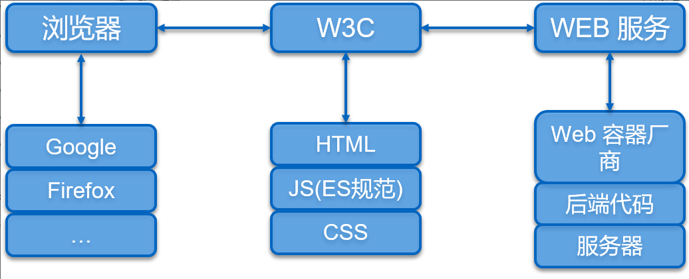
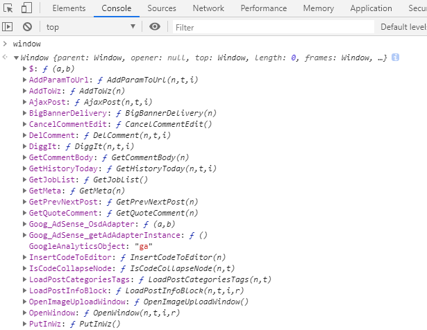

# WEB 应用安全开发

黑客大部分利用的是软件的漏洞，所以我们要尽可能在开发的时候切断所有可能被利用的地方。要想开发出安全的系统，我们需要熟悉黑客进攻的模式和防守的策略。

# 简介

重视安全最好的策略是将风险最大化，开发的时候要换位思考，如果我是黑客我是不是有办法绕过当前的限制。在进行具体场景讲解前，先来了解一些关键词。

## 关键名词

- **同域：** 相同域名，端口相同，协议相同，缺一不可。
- **跨域：** 浏览器从一个域名的网页去请求另一个域名的资源时，域名、端口、协议至少有一个不相同，就是跨域。
- **ECMAScript：** 简称（ES）JavaScript 所遵循的语法标准。
- **W3C：** 即 万维网联盟 ，最重要的工作是发展 Web 规范，这些规范描述了 Web 的通信协议（比如 HTML 和 XHTML）和其他的构建模块。

## 安全领域的参与者

把握安全领域就要把握 Web 流程中的参与者，除了攻击者外其它角色均需要提供安全的解决方案。从大的方向有下面几大角色，没有谁是绝对安全的。



#  前端安全开发

前端的安全主要围绕 W3C 进行，同时浏览器的漏洞和 Http 协议本身的缺陷也会造成影响。

##  明文防范

W3C 三个核心对象：HTML，JavaScript，CSS 分别负责了网站的内容结构，动作交互逻辑，展示样式。这么核心的东西在客户都是很容易查看的。虽然 JavaScript 可以混淆加密，但是最终他是需要被浏览器解析的，所以肯定是有一套固定的规范，黑客同样可以轻易解密。

明文也就算了，用户居然可以任意更改上面 W3C 的核心对象，并产生不同的效果，真的是危机四伏。

- 不要异想天开的在前端与后台约定某个加密算法，这样算法一下子就泄露了；
- 对于前端的输入都要保持怀疑，重要的数据如果后端允许，需要自行生成或者加以校验；
- 虽然客户端的一览无遗，但是还是要尽量使用 Https 协议，保证传输的过程是加密的；
- 需要权限的操作，即使前端按钮隐藏了，后端的接口也需要重新鉴权下，很可能客户端自己修改 CSS 使按钮显示出来了；

## URL 导致的泄露问题

前端任何地方带有 URL 的都要引起警惕，主要可能带来下面安全问题：

1. 构建系统的某些接口等用户登录后触发；
2. 调用别的网站，将该作用域下的 Cookie 传输出去。

常见隐藏点：

图片

```html

```

css 样式

```css
background:url(bgimage.gif)
```

表单 action 地址，或者注入隐藏的 input 参数

```html
<form action=''>
<input type="hidden" name="field＿name" value="value"> 
```

## window 下的全局变量

Window 下面带了很多可以直接使用的全局变量，要警惕危险。



危险点：利用 window.document 获取本域 cookie 然后传输到黑客的网站

```html

```

容易受跨站脚本攻击利用

```js
window.location.href = 【该值最好不要是动态的，容易被注入】
```

# 后端安全开发

## 规范问题

1. 权威机构平台漏洞订阅，并及时做出修改。
2. 开发规范的遵守
   - 学习相关开发规范手册。
   - IDEA 安装实时的代码扫描插件，有问题的地方及时更正。
3. 代码 review 实践。
4. 重要参数不要轻易在日志中输出。
5. 代码泄露
   - 代码不要上传网上。
   - 数据库，签名算法，密钥值 要重要保管，线上不相关的人不要泄露。
6. 重要账号不要为了一时方便提供给开发，测试 等不相干人员，如果有也要及时修改密码。

## 设计问题

1. 类似活动的抽奖，优惠卷领取逻辑不够严谨，可能被人褥羊毛；
2. 登录没有限制次数，容易被暴力破解；
3. 短信验证没有设置重发时间，容易被利用做短信轰炸。

##  信任问题

1. 同域：检查请求头的 **ref** 参数，要么是同域的，要么是信任的才响应。
2. 请求参数
   - 不要太信任前端参数，重要值后台能获取的尽量自己获取。
   - 请求的所有参数都做下 XSS/ SQL 注入 的关键字符的过滤。
3. 权限：涉及到权限的后端都要自己校验，不要说前端按钮隐藏了就可以了

## 增加风控逻辑

1. 用户的账号异地登陆，可以做出些限制或提醒。
2. 某个用户购买的某个商品或者领取的优惠卷异常多，做出限制。
3. 通过 AI 智能模型，对用户行为，流量数据进行检测，模型异常就做出限制。

## 网络策略限制

1. 数据库，Redis，ES，等需要设置访问的 IP 白名单。
2. 对服务器进流量和出流量端口做限制。
3. 架构上面尽量隐藏内部服务等地址。
4. 数据库和应用最好分开，以免被一锅端。

# 小结

安全问题需要经验累积，软件开发作为一个团队协作的工作，大家经验水平不同，所以尽量在团队中分享安全开发的相关知识，技术 Leader 定期 Review 组员代码。